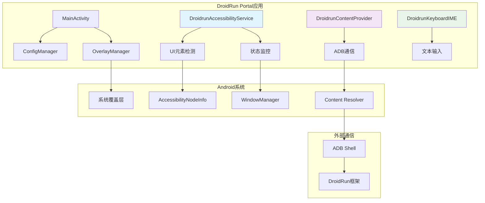

# DroidRun Portal - Android无障碍桥接服务

<div align="center">


**📱 AI驱动设备控制的高级Android无障碍服务**

[](https://android-arsenal.com/api?level=30)
[](https://kotlinlang.org)
[](LICENSE)

[🔗 主框架](https://github.com/droidrun/droidrun) • [📖 文档](https://docs.droidrun.ai/) • [🚀 快速开始](#快速开始)

</div>

## 🌟 概述

DroidRun Portal是一个复杂的Android无障碍服务，作为AI智能体和Android设备之间的桥梁。它提供实时UI元素检测、视觉反馈，以及与DroidRun框架的无缝通信，实现自动化设备控制。

### ✨ 核心特性

- 🔍 **实时UI检测**: 先进的无障碍服务，全面分析UI元素
- 🎯 **可视化覆盖系统**: 可自定义位置的交互元素高亮显示
- 📡 **ADB通信桥梁**: 通过ContentProvider实现无缝数据交换
- ⌨️ **自定义输入法**: 专门的键盘IME用于文本输入操作
- 🔄 **实时状态监控**: 持续跟踪设备和应用状态
- 🎨 **Material Design界面**: 现代直观的配置和监控界面
- 🛡️ **隐私保护**: 所有处理都在设备本地进行

## 🏗️ 架构设计

DroidRun Portal采用模块化架构，专为性能和可靠性而设计：



### 🔧 核心组件

#### 1. **DroidrunAccessibilityService** - 核心引擎
- **实时UI扫描**: 持续监控无障碍树变化
- **元素索引**: 自动为交互元素分配唯一索引
- **状态聚合**: 全面的设备和应用状态收集
- **覆盖层管理**: 动态视觉反馈系统
- **性能优化**: 高效处理，最小化电池影响

#### 2. **DroidrunContentProvider** - 通信中心
- **ADB桥接**: 与外部框架的安全通信通道
- **RESTful端点**: 用于状态查询和操作执行的清洁API
- **数据序列化**: 基于JSON的数据交换格式
- **错误处理**: 强大的错误报告和恢复机制

#### 3. **OverlayManager** - 可视化界面
- **元素高亮**: UI元素的颜色编码可视化
- **位置校正**: 针对不同屏幕配置的自动调整
- **动态更新**: 基于UI变化的实时覆盖层刷新
- **可定制外观**: 用户可配置的颜色和位置

#### 4. **DroidrunKeyboardIME** - 输入专家
- **Base64文本输入**: 安全的文本传输和输入
- **直接按键事件**: 硬件按键模拟
- **输入连接管理**: 可靠的文本字段交互
- **多语言支持**: Unicode兼容的文本处理

## 🚀 快速开始

### 前置要求

- **Android 11+ (API 30+)**
- **已启用USB调试**
- **DroidRun框架**已安装在连接的计算机上
- **已授予无障碍权限**

### 安装

#### 方法1: 自动安装(推荐)
```bash
# 从DroidRun框架
droidrun setup
```

#### 方法2: 手动安装
1. 从[发布页面](https://github.com/droidrun/droidrun-portal/releases)下载最新APK
2. 通过ADB安装:
```bash
adb install droidrun-portal.apk
```

### 设置与配置

1. **在Android设备上启动DroidRun Portal**

2. **启用无障碍服务**:
   - 点击应用中的无障碍状态卡片
   - 导航到设置 > 无障碍 > DroidRun Portal
   - 打开服务开关
   - 授予必要权限

3. **配置可视化覆盖层**(可选):
   - 在主应用中切换覆盖层可见性
   - 使用滑块或文本输入调整位置偏移
   - 元素将用彩色矩形和索引高亮显示

4. **测试连接**:
   - 使用"获取状态"按钮验证功能
   - 检查UI元素是否正确检测和索引

### 验证

使用简单的ADB命令测试安装:
```bash
# 查询设备状态
adb shell content query --uri content://com.droidrun.portal/state

# 预期响应: 包含无障碍树和手机状态的JSON
```

## 🔧 API参考

### ContentProvider端点

#### `/state` - 组合状态查询
返回包括UI树和手机信息的综合设备状态。

**用法:**
```bash
adb shell content query --uri content://com.droidrun.portal/state
```

**响应:**
```json
{
  "status": "success",
  "data": {
    "a11y_tree": [...],
    "phone_state": {
      "currentApp": "设置",
      "packageName": "com.android.settings",
      "keyboardVisible": false,
      "focusedElement": {...}
    }
  }
}
```

#### `/a11y_tree` - 无障碍树
返回带有索引元素的当前无障碍树。

#### `/phone_state` - 设备状态
返回当前应用、键盘状态和焦点元素信息。

#### `/ping` - 健康检查
简单的连接测试端点。

### 键盘操作

#### 文本输入
```bash
adb shell content insert --uri content://com.droidrun.portal/keyboard/input \
  --bind base64_text:s:SGVsbG8gV29ybGQ=  # "Hello World"的base64编码
```

#### 清除文本
```bash
adb shell content insert --uri content://com.droidrun.portal/keyboard/clear
```

#### 按键事件
```bash
adb shell content insert --uri content://com.droidrun.portal/keyboard/key \
  --bind key_code:i:66  # 回车键
```

## 🎯 功能详解

### 实时UI元素检测

无障碍服务持续监控UI层次结构并识别：

- **可点击元素**: 按钮、链接、交互视图
- **输入字段**: 文本输入框、搜索框、表单
- **可滚动容器**: 列表、滚动视图、分页器
- **可选择项**: 复选框、单选按钮、开关
- **文本内容**: 标签、描述、可读文本

每个元素都会获得：
- **唯一索引**: 用于精确定位
- **边界矩形**: 屏幕坐标
- **文本内容**: 可见或可访问的文本
- **类型分类**: 元素类别
- **层次信息**: 父子关系

### 可视化覆盖系统

覆盖层提供实时视觉反馈：

- **颜色编码高亮**: 不同元素类型使用不同颜色
- **索引标签**: 每个元素的数字标识符
- **位置调整**: 针对不同屏幕设置的可配置偏移
- **性能优化**: 高效渲染，影响最小

### 状态监控

全面的设备状态跟踪：

- **当前应用**: 活动应用名称和包名
- **键盘可见性**: 输入法状态
- **焦点元素**: 当前选中的UI组件
- **窗口变化**: 应用转换和导航
- **系统事件**: 通知、对话框、覆盖层

## 🛠️ 开发

### 从源码构建

```bash
# 克隆仓库
git clone https://github.com/droidrun/droidrun-portal.git
cd droidrun-portal

# 构建调试APK
./gradlew assembleDebug

# 安装到连接的设备
./gradlew installDebug
```

### 项目结构
```
app/src/main/
├── java/com/droidrun/portal/
│   ├── DroidrunAccessibilityService.kt    # 核心无障碍服务
│   ├── DroidrunContentProvider.kt         # ADB通信桥梁
│   ├── DroidrunKeyboardIME.kt            # 自定义输入法
│   ├── MainActivity.kt                    # 主配置界面
│   ├── OverlayManager.kt                 # 可视化覆盖系统
│   ├── ConfigManager.kt                  # 设置管理
│   └── model/
│       ├── ElementNode.kt                # UI元素表示
│       └── PhoneState.kt                 # 设备状态模型
├── res/                                  # Android资源
└── AndroidManifest.xml                   # 应用配置
```

### 关键技术

- **Kotlin**: 现代Android开发语言
- **Android无障碍服务**: 核心UI交互API
- **ContentProvider**: 安全的进程间通信
- **输入法编辑器(IME)**: 自定义键盘实现
- **Material Design组件**: 现代UI框架
- **WindowManager**: 系统覆盖层管理

## 🔒 隐私与安全

DroidRun Portal在设计时充分考虑了隐私和安全：

- **本地处理**: 所有UI分析都在设备上进行
- **无网络通信**: 不向外部服务器传输数据
- **最小权限**: 仅请求必要的Android权限
- **安全通信**: 仅通过ADB通信通道
- **用户控制**: 用户完全控制无障碍服务的激活

## 🐛 故障排除

### 常见问题

#### 无障碍服务不工作
- 确保在Android设置中启用了服务
- 检查应用是否有必要权限
- 如需要可重启无障碍服务

#### 覆盖层不可见
- 验证是否授予了覆盖层权限
- 检查应用设置中是否启用了覆盖层
- 如果元素显示在屏幕外，调整位置偏移

#### ADB通信失败
- 确认已启用USB调试
- 使用`adb devices`验证ADB连接
- 检查ContentProvider是否响应

#### 性能问题
- 如需要可降低覆盖层刷新频率
- 关闭不必要的应用以释放内存
- 如果性能下降可重启设备

### 调试信息

启用调试日志：
```bash
# 查看无障碍服务日志
adb logcat -s DroidrunAccessibilityService

# 查看内容提供者日志
adb logcat -s DroidrunContentProvider

# 查看所有DroidRun日志
adb logcat -s DROIDRUN_*
```

## 📱 兼容性

### 支持的Android版本
- **Android 11 (API 30)** - 最低支持版本
- **Android 12 (API 31)** - 完全兼容
- **Android 13 (API 33)** - 完全兼容
- **Android 14 (API 34)** - 完全兼容，支持最新功能

### 测试设备
- Google Pixel系列
- Samsung Galaxy系列
- OnePlus设备
- 小米设备
- 大多数具有标准无障碍实现的Android设备

## 🤝 贡献

我们欢迎对DroidRun Portal的贡献！请查看我们的[贡献指南](../CONTRIBUTING.md)了解详情。

### 开发设置
1. Fork仓库
2. 创建功能分支
3. 进行更改
4. 在真实设备上彻底测试
5. 提交拉取请求

## 📄 许可证

本项目采用MIT许可证 - 详情请查看[LICENSE](LICENSE)文件。

## 🔗 相关项目

- **[DroidRun框架](https://github.com/droidrun/droidrun)**: 主要AI智能体框架
- **[DroidRun文档](https://docs.droidrun.ai/)**: 综合文档
- **[DroidRun示例](https://github.com/droidrun/examples)**: 使用示例和教程

---

<div align="center">

**由DroidRun团队用❤️制作**

[⭐ 在GitHub上给我们点星](https://github.com/droidrun/droidrun-portal) • [🐛 报告问题](https://github.com/droidrun/droidrun-portal/issues) • [💬 加入Discord](https://discord.gg/droidrun)

</div>