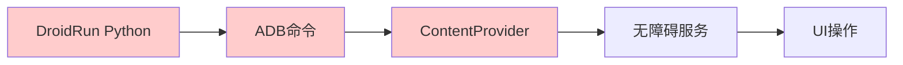
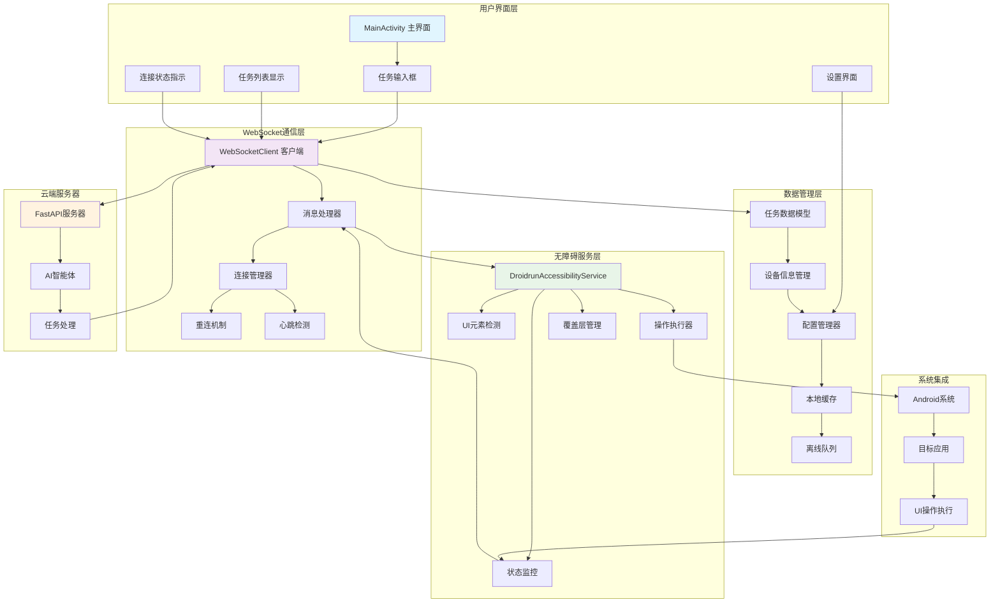
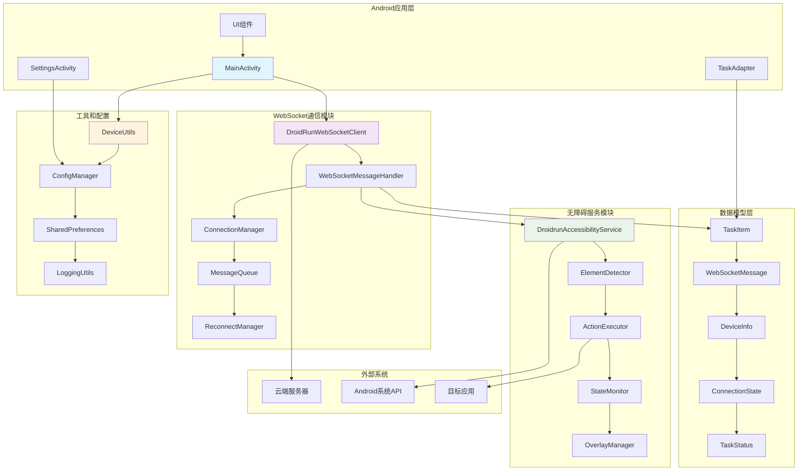
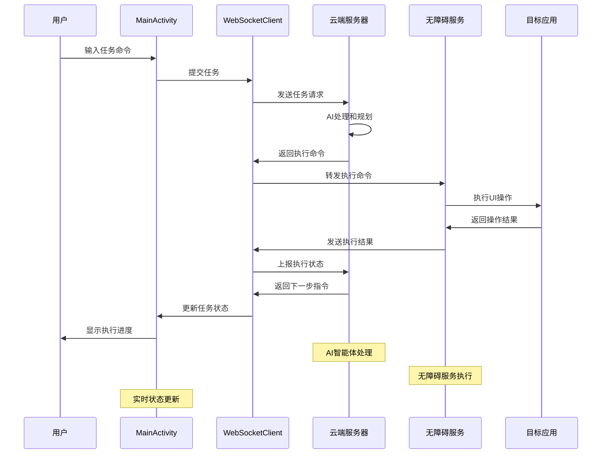
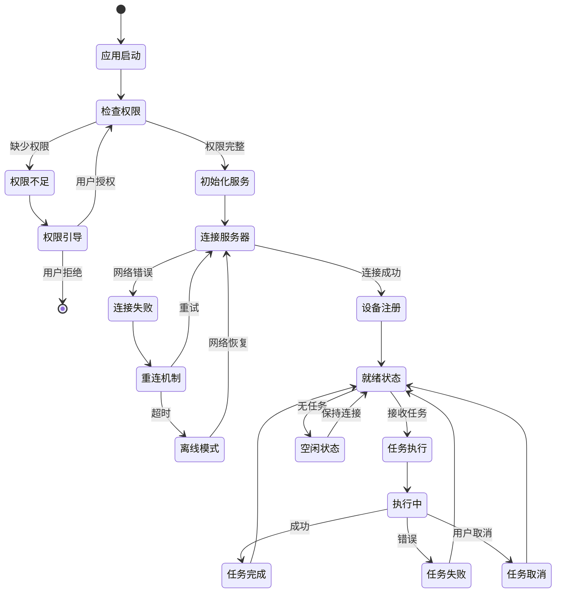
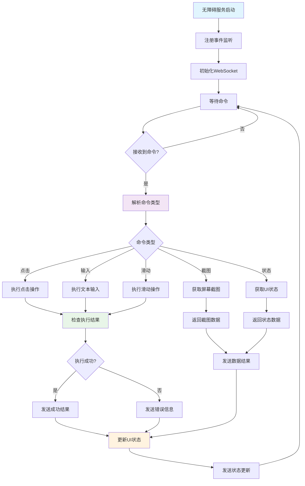

# DroidRun Portal Android应用 - 云端化改造指南

## 📋 改造概述

本指南详细说明如何将DroidRun Portal从基于ADB ContentProvider通信的架构改造为WebSocket实时通信架构。改造后，应用将直接与云端服务器进行WebSocket通信，提供用户友好的移动端界面。

### 🎯 改造目标

- **通信方式转换**: 从ADB ContentProvider转为WebSocket实时通信
- **用户界面升级**: 从配置工具转为完整的用户应用
- **功能扩展**: 新增任务提交、执行监控、历史记录等功能
- **实时反馈**: WebSocket双向通信实现实时状态更新
- **离线支持**: 本地缓存和离线任务队列

## 🏗️ 架构变化对比

### 原架构 (本地ADB模式)


### 新架构 (云端WebSocket模式)


### 🔧 核心组件架构





### 📱 Android应用状态管理



### 🔧 无障碍服务工作流



## 🔧 核心改造任务

### 1. WebSocket通信模块

#### 1.1 创建WebSocket客户端
**文件位置**: `app/src/main/java/com/droidrun/portal/websocket/WebSocketClient.kt`

```kotlin
import okhttp3.*
import okio.ByteString
import org.json.JSONObject
import kotlinx.coroutines.*
import kotlinx.coroutines.flow.MutableStateFlow
import kotlinx.coroutines.flow.StateFlow

class DroidRunWebSocketClient(
    private val serverUrl: String,
    private val deviceId: String
) {
    private var webSocket: WebSocket? = null
    private val client = OkHttpClient.Builder()
        .readTimeout(30, TimeUnit.SECONDS)
        .writeTimeout(30, TimeUnit.SECONDS)
        .build()
    
    private val _connectionState = MutableStateFlow(ConnectionState.DISCONNECTED)
    val connectionState: StateFlow<ConnectionState> = _connectionState
    
    private val _messages = MutableStateFlow<WebSocketMessage?>(null)
    val messages: StateFlow<WebSocketMessage?> = _messages
    
    enum class ConnectionState {
        CONNECTING, CONNECTED, DISCONNECTED, ERROR
    }
    
    data class WebSocketMessage(
        val type: String,
        val data: JSONObject
    )
    
    fun connect() {
        val request = Request.Builder()
            .url("$serverUrl/ws/device/$deviceId")
            .build()
        
        _connectionState.value = ConnectionState.CONNECTING
        
        webSocket = client.newWebSocket(request, object : WebSocketListener() {
            override fun onOpen(webSocket: WebSocket, response: Response) {
                _connectionState.value = ConnectionState.CONNECTED
                Log.d(TAG, "WebSocket连接已建立")
                
                // 发送设备注册信息
                sendDeviceInfo()
            }
            
            override fun onMessage(webSocket: WebSocket, text: String) {
                try {
                    val json = JSONObject(text)
                    val message = WebSocketMessage(
                        type = json.getString("type"),
                        data = json
                    )
                    _messages.value = message
                    handleMessage(message)
                } catch (e: Exception) {
                    Log.e(TAG, "解析WebSocket消息失败", e)
                }
            }
            
            override fun onFailure(webSocket: WebSocket, t: Throwable, response: Response?) {
                _connectionState.value = ConnectionState.ERROR
                Log.e(TAG, "WebSocket连接失败", t)
                
                // 自动重连
                scheduleReconnect()
            }
            
            override fun onClosed(webSocket: WebSocket, code: Int, reason: String) {
                _connectionState.value = ConnectionState.DISCONNECTED
                Log.d(TAG, "WebSocket连接已关闭: $reason")
            }
        })
    }
    
    fun sendMessage(type: String, data: JSONObject) {
        val message = JSONObject().apply {
            put("type", type)
            put("device_id", deviceId)
            put("timestamp", System.currentTimeMillis())
            // 合并数据
            data.keys().forEach { key ->
                put(key, data.get(key))
            }
        }
        
        webSocket?.send(message.toString())
    }
    
    fun submitTask(command: String) {
        val currentState = getCurrentDeviceState()
        sendMessage("new_task", JSONObject().apply {
            put("command", command)
            put("device_state", currentState)
        })
    }
    
    private fun handleMessage(message: WebSocketMessage) {
        when (message.type) {
            "command" -> executeCommand(message.data)
            "task_status" -> updateTaskStatus(message.data)
            "ping" -> sendPong()
            else -> Log.w(TAG, "未知消息类型: ${message.type}")
        }
    }
    
    private fun executeCommand(data: JSONObject) {
        val action = data.getString("action")
        val params = data.optJSONObject("params") ?: JSONObject()
        val requestId = data.getString("request_id")
        
        // 通过无障碍服务执行命令
        val accessibilityService = DroidrunAccessibilityService.getInstance()
        if (accessibilityService != null) {
            executeAccessibilityAction(action, params, requestId)
        } else {
            sendExecutionResult(requestId, false, "无障碍服务不可用")
        }
    }
    
    private fun sendExecutionResult(requestId: String, success: Boolean, message: String = "") {
        val newState = getCurrentDeviceState()
        sendMessage("execution_result", JSONObject().apply {
            put("request_id", requestId)
            put("success", success)
            put("message", message)
            put("new_state", newState)
        })
    }
    
    companion object {
        private const val TAG = "DroidRunWebSocketClient"
    }
}
```

#### 1.2 WebSocket消息处理器
**文件位置**: `app/src/main/java/com/droidrun/portal/websocket/MessageHandler.kt`

```kotlin
class WebSocketMessageHandler(
    private val accessibilityService: DroidrunAccessibilityService,
    private val webSocketClient: DroidRunWebSocketClient
) {
    
    suspend fun executeAccessibilityAction(
        action: String, 
        params: JSONObject, 
        requestId: String
    ) {
        try {
            val result = when (action) {
                "tap_by_index" -> {
                    val index = params.getInt("index")
                    performTapByIndex(index)
                }
                "input_text" -> {
                    val text = params.getString("text")
                    performTextInput(text)
                }
                "swipe" -> {
                    val startX = params.getInt("start_x")
                    val startY = params.getInt("start_y")
                    val endX = params.getInt("end_x")
                    val endY = params.getInt("end_y")
                    performSwipe(startX, startY, endX, endY)
                }
                "press_key" -> {
                    val keyCode = params.getInt("key_code")
                    performKeyPress(keyCode)
                }
                "take_screenshot" -> {
                    takeScreenshot()
                }
                else -> {
                    throw IllegalArgumentException("未知操作: $action")
                }
            }
            
            webSocketClient.sendExecutionResult(requestId, true, result.toString())
            
        } catch (e: Exception) {
            Log.e(TAG, "执行操作失败: $action", e)
            webSocketClient.sendExecutionResult(requestId, false, e.message ?: "未知错误")
        }
    }
    
    private fun performTapByIndex(index: Int): Boolean {
        val elements = accessibilityService.getVisibleElements()
        val targetElement = elements.find { it.overlayIndex == index }
        
        return if (targetElement != null) {
            val centerX = targetElement.rect.centerX()
            val centerY = targetElement.rect.centerY()
            
            // 使用无障碍服务执行点击
            targetElement.nodeInfo.performAction(AccessibilityNodeInfo.ACTION_CLICK)
        } else {
            false
        }
    }
    
    private fun performTextInput(text: String): Boolean {
        val focusedNode = accessibilityService.findFocus(AccessibilityNodeInfo.FOCUS_INPUT)
        return if (focusedNode != null) {
            val arguments = Bundle().apply {
                putCharSequence(AccessibilityNodeInfo.ACTION_ARGUMENT_SET_TEXT_CHARSEQUENCE, text)
            }
            focusedNode.performAction(AccessibilityNodeInfo.ACTION_SET_TEXT, arguments)
        } else {
            false
        }
    }
    
    companion object {
        private const val TAG = "WebSocketMessageHandler"
    }
}
```

### 2. 用户界面重构

#### 2.1 主界面改造
**文件位置**: `app/src/main/java/com/droidrun/portal/ui/MainActivity.kt`

```kotlin
class MainActivity : AppCompatActivity() {
    
    private lateinit var binding: ActivityMainBinding
    private lateinit var webSocketClient: DroidRunWebSocketClient
    private lateinit var taskAdapter: TaskAdapter
    
    private val tasks = mutableListOf<TaskItem>()
    
    override fun onCreate(savedInstanceState: Bundle?) {
        super.onCreate(savedInstanceState)
        binding = ActivityMainBinding.inflate(layoutInflater)
        setContentView(binding.root)
        
        setupWebSocket()
        setupUI()
        setupTaskList()
    }
    
    private fun setupWebSocket() {
        val deviceId = getDeviceId()
        val serverUrl = getServerUrl()
        
        webSocketClient = DroidRunWebSocketClient(serverUrl, deviceId)
        
        // 观察连接状态
        lifecycleScope.launch {
            webSocketClient.connectionState.collect { state ->
                updateConnectionStatus(state)
            }
        }
        
        // 观察消息
        lifecycleScope.launch {
            webSocketClient.messages.collect { message ->
                message?.let { handleWebSocketMessage(it) }
            }
        }
        
        // 连接WebSocket
        webSocketClient.connect()
    }
    
    private fun setupUI() {
        // 任务输入
        binding.taskInput.setOnEditorActionListener { _, actionId, _ ->
            if (actionId == EditorInfo.IME_ACTION_SEND) {
                submitTask()
                true
            } else {
                false
            }
        }
        
        binding.submitButton.setOnClickListener {
            submitTask()
        }
        
        // 连接状态指示器
        binding.connectionStatus.setOnClickListener {
            if (webSocketClient.connectionState.value == ConnectionState.DISCONNECTED) {
                webSocketClient.connect()
            }
        }
        
        // 设置按钮
        binding.settingsButton.setOnClickListener {
            startActivity(Intent(this, SettingsActivity::class.java))
        }
    }
    
    private fun submitTask() {
        val command = binding.taskInput.text.toString().trim()
        if (command.isNotEmpty()) {
            // 添加到任务列表
            val task = TaskItem(
                id = UUID.randomUUID().toString(),
                command = command,
                status = TaskStatus.PENDING,
                timestamp = System.currentTimeMillis()
            )
            tasks.add(0, task)
            taskAdapter.notifyItemInserted(0)
            
            // 提交到服务器
            webSocketClient.submitTask(command)
            
            // 清空输入框
            binding.taskInput.text.clear()
        }
    }
    
    private fun handleWebSocketMessage(message: WebSocketMessage) {
        when (message.type) {
            "task_started" -> {
                val taskId = message.data.getString("task_id")
                updateTaskStatus(taskId, TaskStatus.RUNNING)
            }
            "task_completed" -> {
                val taskId = message.data.getString("task_id")
                val success = message.data.getBoolean("success")
                val result = message.data.optString("result", "")
                
                updateTaskStatus(
                    taskId, 
                    if (success) TaskStatus.COMPLETED else TaskStatus.FAILED,
                    result
                )
            }
            "task_progress" -> {
                val taskId = message.data.getString("task_id")
                val progress = message.data.getString("progress")
                updateTaskProgress(taskId, progress)
            }
        }
    }
}
```

#### 2.2 任务列表界面
**文件位置**: `app/src/main/java/com/droidrun/portal/ui/TaskAdapter.kt`

```kotlin
data class TaskItem(
    val id: String,
    val command: String,
    var status: TaskStatus,
    val timestamp: Long,
    var result: String = "",
    var progress: String = ""
)

enum class TaskStatus {
    PENDING, RUNNING, COMPLETED, FAILED
}

class TaskAdapter(private val tasks: List<TaskItem>) : 
    RecyclerView.Adapter<TaskAdapter.TaskViewHolder>() {
    
    class TaskViewHolder(private val binding: ItemTaskBinding) : 
        RecyclerView.ViewHolder(binding.root) {
        
        fun bind(task: TaskItem) {
            binding.taskCommand.text = task.command
            binding.taskTime.text = formatTime(task.timestamp)
            binding.taskResult.text = task.result
            
            // 设置状态指示器
            when (task.status) {
                TaskStatus.PENDING -> {
                    binding.statusIndicator.setColorFilter(Color.GRAY)
                    binding.statusText.text = "等待中"
                }
                TaskStatus.RUNNING -> {
                    binding.statusIndicator.setColorFilter(Color.BLUE)
                    binding.statusText.text = "执行中"
                    binding.progressText.text = task.progress
                    binding.progressText.visibility = View.VISIBLE
                }
                TaskStatus.COMPLETED -> {
                    binding.statusIndicator.setColorFilter(Color.GREEN)
                    binding.statusText.text = "已完成"
                    binding.progressText.visibility = View.GONE
                }
                TaskStatus.FAILED -> {
                    binding.statusIndicator.setColorFilter(Color.RED)
                    binding.statusText.text = "失败"
                    binding.progressText.visibility = View.GONE
                }
            }
        }
    }
}
```

### 3. 无障碍服务集成

#### 3.1 无障碍服务适配
**文件位置**: `app/src/main/java/com/droidrun/portal/DroidrunAccessibilityService.kt` (修改)

```kotlin
class DroidrunAccessibilityService : AccessibilityService() {

    private var webSocketClient: DroidRunWebSocketClient? = null
    private var messageHandler: WebSocketMessageHandler? = null

    override fun onServiceConnected() {
        super.onServiceConnected()

        // 初始化WebSocket连接
        initializeWebSocket()

        // 现有的初始化代码保持不变
        setupAccessibilityService()
    }

    private fun initializeWebSocket() {
        val deviceId = getDeviceId()
        val serverUrl = getServerUrl()

        webSocketClient = DroidRunWebSocketClient(serverUrl, deviceId)
        messageHandler = WebSocketMessageHandler(this, webSocketClient!!)

        // 连接到服务器
        webSocketClient?.connect()

        // 监听WebSocket消息
        GlobalScope.launch {
            webSocketClient?.messages?.collect { message ->
                message?.let {
                    messageHandler?.handleMessage(it)
                }
            }
        }
    }

    override fun onAccessibilityEvent(event: AccessibilityEvent?) {
        super.onAccessibilityEvent(event)

        // 现有的事件处理逻辑保持不变
        handleAccessibilityEvent(event)

        // 新增：向服务器发送状态更新
        sendStateUpdate()
    }

    private fun sendStateUpdate() {
        webSocketClient?.let { client ->
            val currentState = getCurrentDeviceState()
            client.sendMessage("state_update", JSONObject().apply {
                put("state", currentState)
            })
        }
    }

    fun getCurrentDeviceState(): JSONObject {
        return JSONObject().apply {
            put("a11y_tree", getAccessibilityTreeJson())
            put("phone_state", getPhoneStateJson())
            put("timestamp", System.currentTimeMillis())
        }
    }

    private fun getAccessibilityTreeJson(): JSONArray {
        val elements = getVisibleElements()
        val jsonArray = JSONArray()

        elements.forEach { element ->
            jsonArray.put(buildElementNodeJson(element))
        }

        return jsonArray
    }

    private fun getPhoneStateJson(): JSONObject {
        val phoneState = getPhoneState()
        return buildPhoneStateJson(phoneState)
    }
}
```

#### 3.2 设备信息管理
**文件位置**: `app/src/main/java/com/droidrun/portal/utils/DeviceUtils.kt`

```kotlin
object DeviceUtils {

    fun getDeviceId(context: Context): String {
        val sharedPrefs = context.getSharedPreferences("droidrun_prefs", Context.MODE_PRIVATE)
        var deviceId = sharedPrefs.getString("device_id", null)

        if (deviceId == null) {
            deviceId = generateDeviceId()
            sharedPrefs.edit().putString("device_id", deviceId).apply()
        }

        return deviceId
    }

    private fun generateDeviceId(): String {
        return "droidrun_${UUID.randomUUID().toString().replace("-", "").substring(0, 12)}"
    }

    fun getDeviceInfo(context: Context): JSONObject {
        return JSONObject().apply {
            put("device_id", getDeviceId(context))
            put("device_name", Build.MODEL)
            put("brand", Build.BRAND)
            put("android_version", Build.VERSION.RELEASE)
            put("sdk_level", Build.VERSION.SDK_INT)
            put("app_version", getAppVersion(context))
            put("screen_width", getScreenWidth(context))
            put("screen_height", getScreenHeight(context))
        }
    }

    private fun getAppVersion(context: Context): String {
        return try {
            val packageInfo = context.packageManager.getPackageInfo(context.packageName, 0)
            packageInfo.versionName
        } catch (e: Exception) {
            "unknown"
        }
    }

    private fun getScreenWidth(context: Context): Int {
        val displayMetrics = context.resources.displayMetrics
        return displayMetrics.widthPixels
    }

    private fun getScreenHeight(context: Context): Int {
        val displayMetrics = context.resources.displayMetrics
        return displayMetrics.heightPixels
    }
}

### 4. 配置管理

#### 4.1 设置界面
**文件位置**: `app/src/main/java/com/droidrun/portal/ui/SettingsActivity.kt`

```kotlin
class SettingsActivity : AppCompatActivity() {

    private lateinit var binding: ActivitySettingsBinding
    private lateinit var sharedPrefs: SharedPreferences

    override fun onCreate(savedInstanceState: Bundle?) {
        super.onCreate(savedInstanceState)
        binding = ActivitySettingsBinding.inflate(layoutInflater)
        setContentView(binding.root)

        sharedPrefs = getSharedPreferences("droidrun_prefs", Context.MODE_PRIVATE)

        setupUI()
        loadSettings()
    }

    private fun setupUI() {
        // 服务器URL设置
        binding.serverUrlInput.addTextChangedListener(object : TextWatcher {
            override fun afterTextChanged(s: Editable?) {
                val url = s.toString().trim()
                if (url.isNotEmpty()) {
                    saveServerUrl(url)
                }
            }
            override fun beforeTextChanged(s: CharSequence?, start: Int, count: Int, after: Int) {}
            override fun onTextChanged(s: CharSequence?, start: Int, before: Int, count: Int) {}
        })

        // 自动连接开关
        binding.autoConnectSwitch.setOnCheckedChangeListener { _, isChecked ->
            saveAutoConnect(isChecked)
        }

        // 覆盖层设置
        binding.overlaySwitch.setOnCheckedChangeListener { _, isChecked ->
            saveOverlayEnabled(isChecked)
            toggleOverlay(isChecked)
        }

        // 测试连接按钮
        binding.testConnectionButton.setOnClickListener {
            testConnection()
        }

        // 重置设置按钮
        binding.resetButton.setOnClickListener {
            resetSettings()
        }
    }

    private fun loadSettings() {
        binding.serverUrlInput.setText(getServerUrl())
        binding.autoConnectSwitch.isChecked = getAutoConnect()
        binding.overlaySwitch.isChecked = getOverlayEnabled()
        binding.deviceIdText.text = DeviceUtils.getDeviceId(this)
    }

    private fun testConnection() {
        binding.testConnectionButton.isEnabled = false
        binding.connectionStatus.text = "测试中..."

        val serverUrl = binding.serverUrlInput.text.toString().trim()
        val deviceId = DeviceUtils.getDeviceId(this)

        // 创建临时WebSocket连接进行测试
        val testClient = DroidRunWebSocketClient(serverUrl, deviceId)

        lifecycleScope.launch {
            testClient.connectionState.collect { state ->
                when (state) {
                    ConnectionState.CONNECTED -> {
                        binding.connectionStatus.text = "连接成功"
                        binding.connectionStatus.setTextColor(Color.GREEN)
                        testClient.disconnect()
                    }
                    ConnectionState.ERROR -> {
                        binding.connectionStatus.text = "连接失败"
                        binding.connectionStatus.setTextColor(Color.RED)
                    }
                    ConnectionState.CONNECTING -> {
                        binding.connectionStatus.text = "连接中..."
                        binding.connectionStatus.setTextColor(Color.BLUE)
                    }
                    else -> {}
                }
                binding.testConnectionButton.isEnabled = true
            }
        }

        testClient.connect()
    }

    // 配置保存和读取方法
    private fun saveServerUrl(url: String) {
        sharedPrefs.edit().putString("server_url", url).apply()
    }

    private fun getServerUrl(): String {
        return sharedPrefs.getString("server_url", "ws://localhost:8000") ?: "ws://localhost:8000"
    }

    private fun saveAutoConnect(enabled: Boolean) {
        sharedPrefs.edit().putBoolean("auto_connect", enabled).apply()
    }

    private fun getAutoConnect(): Boolean {
        return sharedPrefs.getBoolean("auto_connect", true)
    }
}
```

## 📦 依赖管理

### 5.1 Gradle依赖更新
**文件位置**: `app/build.gradle.kts` (修改)

```kotlin
dependencies {
    // 现有依赖保持不变
    implementation(libs.androidx.core.ktx)
    implementation(libs.androidx.appcompat)
    implementation(libs.material)

    // 新增WebSocket和网络依赖
    implementation("com.squareup.okhttp3:okhttp:4.12.0")
    implementation("com.squareup.okhttp3:logging-interceptor:4.12.0")

    // JSON处理
    implementation("com.google.code.gson:gson:2.10.1")

    // 协程支持
    implementation("org.jetbrains.kotlinx:kotlinx-coroutines-android:1.7.3")

    // ViewModel和LiveData
    implementation("androidx.lifecycle:lifecycle-viewmodel-ktx:2.7.0")
    implementation("androidx.lifecycle:lifecycle-livedata-ktx:2.7.0")

    // RecyclerView
    implementation("androidx.recyclerview:recyclerview:1.3.2")

    // ViewBinding
    buildFeatures {
        viewBinding = true
    }

    // 测试依赖
    testImplementation(libs.junit)
    androidTestImplementation(libs.androidx.junit)
    androidTestImplementation(libs.androidx.espresso.core)

    // WebSocket测试
    testImplementation("com.squareup.okhttp3:mockwebserver:4.12.0")
}
```

### 5.2 权限配置
**文件位置**: `app/src/main/AndroidManifest.xml` (修改)

```xml
<manifest xmlns:android="http://schemas.android.com/apk/res/android">

    <!-- 现有权限保持不变 -->
    <uses-permission android:name="android.permission.SYSTEM_ALERT_WINDOW" />
    <uses-permission android:name="android.permission.ACCESSIBILITY_SERVICE" />

    <!-- 新增网络权限 -->
    <uses-permission android:name="android.permission.INTERNET" />
    <uses-permission android:name="android.permission.ACCESS_NETWORK_STATE" />

    <!-- 前台服务权限 (用于保持WebSocket连接) -->
    <uses-permission android:name="android.permission.FOREGROUND_SERVICE" />
    <uses-permission android:name="android.permission.WAKE_LOCK" />

    <application
        android:allowBackup="true"
        android:icon="@mipmap/ic_launcher"
        android:label="@string/app_name"
        android:theme="@style/Theme.Droidrun">

        <!-- 主Activity -->
        <activity
            android:name=".ui.MainActivity"
            android:exported="true"
            android:launchMode="singleTop">
            <intent-filter>
                <action android:name="android.intent.action.MAIN" />
                <category android:name="android.intent.category.LAUNCHER" />
            </intent-filter>
        </activity>

        <!-- 设置Activity -->
        <activity
            android:name=".ui.SettingsActivity"
            android:exported="false"
            android:parentActivityName=".ui.MainActivity" />

        <!-- 无障碍服务 (WebSocket模式) -->
        <service
            android:name=".DroidrunAccessibilityService"
            android:enabled="true"
            android:exported="false"
            android:permission="android.permission.BIND_ACCESSIBILITY_SERVICE">
            <intent-filter>
                <action android:name="android.accessibilityservice.AccessibilityService" />
            </intent-filter>
            <meta-data
                android:name="android.accessibilityservice"
                android:resource="@xml/accessibility_service_config" />
        </service>

        <!-- WebSocket前台服务 -->
        <service
            android:name=".service.WebSocketService"
            android:enabled="true"
            android:exported="false"
            android:foregroundServiceType="dataSync" />

    </application>
</manifest>
```

## 🔄 实施策略

### 6.1 一步到位改造方案

#### 完整改造任务清单 (4周)
- [ ] **Week 1**: WebSocket通信层
  - [ ] 实现WebSocketClient完整类
  - [ ] 创建消息处理器
  - [ ] 建立与云端服务器的连接
  - [ ] 实现基本的ping/pong心跳

- [ ] **Week 2**: 用户界面重构
  - [ ] 完全重新设计MainActivity
  - [ ] 实现任务提交界面
  - [ ] 创建任务列表和状态显示
  - [ ] 添加设置界面

- [ ] **Week 3**: 无障碍服务集成
  - [ ] 完全重写无障碍服务
  - [ ] 实现WebSocket命令执行
  - [ ] 添加状态同步机制
  - [ ] 测试完整执行流程

- [ ] **Week 4**: 优化和测试
  - [ ] 性能优化和内存管理
  - [ ] 错误处理和重连机制
  - [ ] 用户体验优化
  - [ ] 全面测试和调试

### 6.2 移除组件
- **删除ContentProvider**: 完全移除ADB通信相关代码
- **删除ADB依赖**: 移除所有ADB相关功能
- **简化架构**: 只保留WebSocket通信方式
- **清理配置**: 移除ADB相关配置和权限

## 🧪 测试策略

### 7.1 单元测试
**文件位置**: `app/src/test/java/com/droidrun/portal/WebSocketClientTest.kt`

```kotlin
@RunWith(MockitoJUnitRunner::class)
class WebSocketClientTest {

    @Mock
    private lateinit var mockWebSocket: WebSocket

    @Mock
    private lateinit var mockOkHttpClient: OkHttpClient

    private lateinit var webSocketClient: DroidRunWebSocketClient

    @Before
    fun setup() {
        webSocketClient = DroidRunWebSocketClient("ws://test.com", "test_device")
    }

    @Test
    fun `test connection state changes`() = runTest {
        // 测试连接状态变化
        val states = mutableListOf<ConnectionState>()

        val job = launch {
            webSocketClient.connectionState.collect {
                states.add(it)
            }
        }

        // 模拟连接过程
        webSocketClient.connect()

        // 验证状态变化
        assertEquals(ConnectionState.CONNECTING, states[0])

        job.cancel()
    }

    @Test
    fun `test message sending`() {
        val testData = JSONObject().apply {
            put("test", "value")
        }

        webSocketClient.sendMessage("test_type", testData)

        // 验证消息发送
        verify(mockWebSocket).send(any<String>())
    }
}
```

### 7.2 UI测试
**文件位置**: `app/src/androidTest/java/com/droidrun/portal/MainActivityTest.kt`

```kotlin
@RunWith(AndroidJUnit4::class)
class MainActivityTest {

    @get:Rule
    val activityRule = ActivityScenarioRule(MainActivity::class.java)

    @Test
    fun testTaskSubmission() {
        // 输入任务命令
        onView(withId(R.id.taskInput))
            .perform(typeText("打开设置"))

        // 点击提交按钮
        onView(withId(R.id.submitButton))
            .perform(click())

        // 验证任务添加到列表
        onView(withId(R.id.taskRecyclerView))
            .check(matches(hasDescendant(withText("打开设置"))))
    }

    @Test
    fun testConnectionStatus() {
        // 检查连接状态显示
        onView(withId(R.id.connectionStatus))
            .check(matches(isDisplayed()))
    }
}
```

### 7.3 集成测试
- WebSocket连接稳定性测试
- 无障碍服务执行测试
- 端到端任务执行测试
- 网络异常处理测试

## 🚀 部署和发布

### 8.1 构建配置
**文件位置**: `app/build.gradle.kts` (构建变体)

```kotlin
android {
    buildTypes {
        debug {
            isDebuggable = true
            applicationIdSuffix = ".debug"
            versionNameSuffix = "-debug"

            buildConfigField("String", "DEFAULT_SERVER_URL", "\"ws://10.0.2.2:8000\"")
            buildConfigField("boolean", "ENABLE_LOGGING", "true")
        }

        release {
            isMinifyEnabled = true
            proguardFiles(getDefaultProguardFile("proguard-android-optimize.txt"), "proguard-rules.pro")

            buildConfigField("String", "DEFAULT_SERVER_URL", "\"wss://your-server.com\"")
            buildConfigField("boolean", "ENABLE_LOGGING", "false")
        }

        create("staging") {
            initWith(getByName("release"))
            applicationIdSuffix = ".staging"
            versionNameSuffix = "-staging"

            buildConfigField("String", "DEFAULT_SERVER_URL", "\"wss://staging-server.com\"")
            buildConfigField("boolean", "ENABLE_LOGGING", "true")
        }
    }
}
```

### 8.2 混淆配置
**文件位置**: `app/proguard-rules.pro`

```proguard
# 保留WebSocket相关类
-keep class okhttp3.** { *; }
-keep class okio.** { *; }

# 保留JSON相关类
-keep class com.google.gson.** { *; }
-keep class org.json.** { *; }

# 保留无障碍服务
-keep class * extends android.accessibilityservice.AccessibilityService { *; }

# 保留数据模型类
-keep class com.droidrun.portal.model.** { *; }

# 保留WebSocket消息类
-keep class com.droidrun.portal.websocket.** { *; }
```

## ⚠️ 注意事项和限制

### 9.1 技术限制
- **网络依赖**: 必须有稳定的网络连接
- **电池优化**: 需要用户关闭电池优化
- **后台限制**: Android后台执行限制
- **无障碍权限**: 必须授予无障碍服务权限

### 9.2 用户体验考虑
- **首次设置**: 需要引导用户完成配置
- **连接状态**: 清晰的连接状态指示
- **错误处理**: 友好的错误提示和恢复
- **性能影响**: 最小化对设备性能的影响

### 9.3 安全考虑
- **数据传输**: 使用WSS加密传输
- **设备认证**: 实现设备身份验证
- **权限控制**: 最小化权限请求
- **隐私保护**: 本地处理敏感数据

## 📚 相关文档

- [WebSocket通信协议](docs/websocket-protocol.md)
- [无障碍服务集成指南](docs/accessibility-integration.md)
- [用户界面设计规范](docs/ui-design-guide.md)
- [测试和调试指南](docs/testing-guide.md)

---

**改造完成后，DroidRun Portal将成为一个功能完整的移动端AI助手应用，为用户提供直观的任务提交和执行监控界面。**
```
